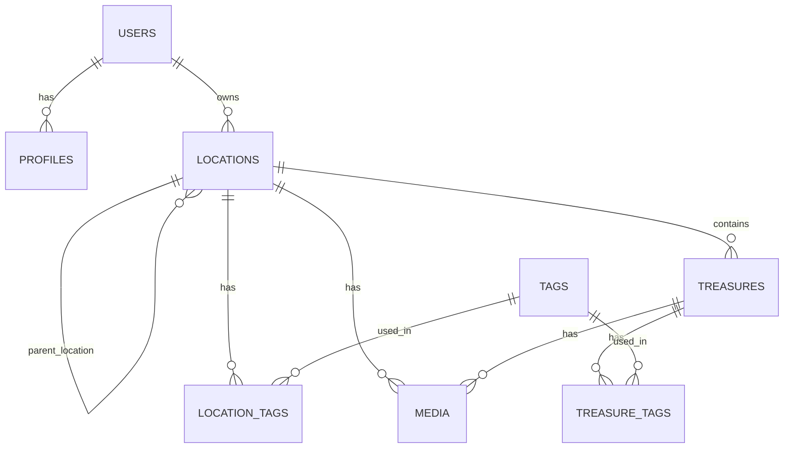

# Presentación Proyecto Nooks

---

## 1. Portada

**Nooks: Organiza tus objetos y experiencias con geolocalización**  
Autor: [Tu nombre]  
Fecha: [Fecha de la presentación]  
![Logo de Nooks]

> **Guía de explicación:**
> Hola, soy [Tu nombre] y os presento Nooks, una app móvil para organizar objetos, experiencias y lugares usando geolocalización, imágenes y etiquetas. Hoy os mostraré tanto la parte funcional como las decisiones técnicas que hay detrás del proyecto.

---

## 2. Introducción y objetivo

- **¿Qué es Nooks?**  
  App móvil para organizar objetos, experiencias y lugares usando geolocalización, imágenes y etiquetas personalizables.
- **Objetivo:**  
  Facilitar la catalogación y localización de cualquier cosa importante para el usuario, desde objetos físicos hasta recuerdos o experiencias.
- **Público objetivo:**  
  Personas que quieren tener control y memoria visual de sus pertenencias, lugares favoritos, hallazgos, etc.

> **Guía de explicación:**
> Nooks nace para resolver el problema de perder objetos o no recordar dónde guardamos cosas importantes. Pero va más allá: permite catalogar no solo objetos, sino también experiencias, hallazgos, flora, comidas, etc. El objetivo es dar al usuario libertad total para organizar su mundo físico y digital, sin imponer categorías fijas. Está pensada para cualquier persona que quiera tener control y memoria visual de sus pertenencias y vivencias.

---

## 3. Stack tecnológico

- **Frontend:**  
  - React Native con Expo (multiplataforma)
  - TypeScript (tipado estricto)
  - Expo Router (navegación declarativa)
  - React Query (gestión de datos)
  - React Hook Form + Zod (formularios y validación)
- **Backend:**  
  - Supabase (Auth, PostgreSQL, Storage)
- **UI:**  
  - Material Design 3 (paleta generada con Material Theme Builder)
- **Otras herramientas:**  
  - EAS Build, Expo Location, React Native Maps

> **Guía de explicación:**
> He elegido Expo y React Native para poder desarrollar una app multiplataforma de forma ágil y con acceso a APIs nativas como mapas y cámara. TypeScript me permite tener tipado estricto y evitar errores en tiempo de desarrollo. Expo Router facilita una navegación declarativa y modular. React Query y React Hook Form me ayudan a gestionar datos y formularios de forma eficiente. Para el backend, uso Supabase, que me da autenticación, base de datos y almacenamiento de imágenes de forma sencilla y segura. La UI sigue Material Design 3, con una paleta generada automáticamente para coherencia visual.

---

## 4. Modelo de datos y jerarquía

- **Diagrama entidad-relación:**



- **Jerarquía:**
  - Tabla única `locations` para realms y nooks (jerarquía por `parent_location_id`)
  - Realms = localización raíz, Nooks = hijos
  - Áreas circulares (`radius`) por simplicidad y compatibilidad con la API de mapas

> ![Captura de la estructura de tablas en Supabase]

> **Guía de explicación:**
> Toda la jerarquía de localizaciones se gestiona en una sola tabla, `locations`, donde un ‘realm’ es una localización raíz y un ‘nook’ es una localización hija. Esto me da flexibilidad para futuras ampliaciones, como sub-niveles o agrupaciones. Para representar áreas, uso un círculo (centro y radio), porque la API gratuita de mapas no permite dibujar áreas poligonales complejas ni overlays elevados. Así, la experiencia es sencilla y compatible en todos los dispositivos.

---

## 5. Almacenamiento de imágenes y tags

- **Imágenes:**
  - Tabla `media` para asociar imágenes a localizaciones y treasures
  - Almacenamiento en Supabase Storage
- **Tags:**
  - Sistema flexible, sin categorías predefinidas
  - Tablas `tags`, `location_tags`, `treasure_tags` para relaciones N:M
  - Ejemplos: etiquetar objetos, experiencias, flora, etc.

> ![Captura de la tabla media y tags en Supabase]

> **Guía de explicación:**
> Las imágenes se almacenan en Supabase Storage y se referencian desde la tabla `media`, que puede asociar imágenes tanto a localizaciones como a treasures. El sistema de tags es totalmente flexible: cada usuario puede crear sus propias etiquetas, sin categorías predefinidas. Esto permite catalogar cualquier cosa: desde un objeto hasta una experiencia, una comida o una flor. Las relaciones N:M permiten que un tag se use en muchos elementos y viceversa.

---

## 6. Seguridad y autenticación

- **Registro y login:**
  - Email y contraseña gestionados por Supabase Auth
- **Recuperación de contraseña:**
  - Email con enlace seguro y deep linking a la app
- **Seguridad:**
  - Tokens JWT, almacenamiento seguro de sesión
  - Row Level Security (RLS) en la base de datos

> **Fragmento de código:**
> ```typescript
> // Registro
> await supabase.auth.signUp({ email, password, options: { emailRedirectTo: 'nooks://' } });
> // Login
> await supabase.auth.signInWithPassword({ email, password });
> // Recuperación
> await supabase.auth.resetPasswordForEmail(email, { redirectTo: 'nooks://reset-password' });
> ```
> ![Captura de la configuración de RLS en Supabase]

> **Guía de explicación:**
> La autenticación se gestiona con Supabase Auth, usando email y contraseña. Las contraseñas nunca viajan ni se almacenan en texto plano. Para recuperar la contraseña, el usuario recibe un email con un enlace seguro que abre la app directamente en la pantalla de restablecimiento, gracias al deep linking. Además, la base de datos tiene Row Level Security, así que cada usuario solo puede acceder a sus propios datos. Todo el sistema es seguro y sigue buenas prácticas por defecto.

---

## 7. Sistema de temas y diseño

- **Paleta de colores:**
  - Generada con Material Theme Builder
  - Soporte para light y dark mode
- **Definición de temas:**
  - Tipos y objetos de tema (`AppTheme`) con colores, spacing, bordes, tipografías
- **Estilos por componente:**
  - Cada componente tiene su propia hoja de estilos

> **Fragmento de código:**
> ```typescript
> // Ejemplo de uso de tema en un componente
> const styles = createStyles(theme);
> <Text style={styles.headerTitle}>Mis Treasures</Text>
> ```
> ![Captura del generador de paleta Material Theme Builder]

> **Guía de explicación:**
> La paleta de colores se ha generado con Material Theme Builder, lo que garantiza una coherencia visual y soporte para light y dark mode. Los temas se definen en un objeto centralizado y cada componente usa su propia hoja de estilos, accediendo a los valores del tema. Así, la app es visualmente consistente y fácil de mantener o personalizar.

---

## 8. Componentes y arquitectura frontend

- **Estructura modular:**
  - Carpeta `features/` para lógica de cada sección
  - Carpeta `components/atoms/` para componentes básicos reutilizables
  - Formularios controlados con React Hook Form y componentes propios
- **Tipado end-to-end:**
  - Tipos generados automáticamente desde Supabase
- **Ejemplo:**
  - Input controlado y hook de datos

> **Fragmento de código:**
> ```typescript
> // ControlledTextInput.tsx
> <Controller
>   control={control}
>   name={name}
>   render={({ field: { onChange, value } }) => (
>     <TextInput value={value} onChangeText={onChange} ... />
>   )}
> />
> ```
> ![Captura de la estructura de carpetas del proyecto]

> **Guía de explicación:**
> La arquitectura es modular: cada sección tiene su carpeta en `features/`, los componentes básicos están en `atoms/` y los formularios usan React Hook Form con componentes controlados. El tipado end-to-end se consigue generando los tipos directamente desde la base de datos de Supabase, lo que evita errores y facilita el desarrollo. Esto permite que cualquier consulta o mutación esté siempre tipada y validada.

---

## 9. Flujos de navegación principales

- **Tabs principales:** Home, Realms, Nooks, Treasures, Map, Tags
- **Flujos de detalle y formularios:**
  - Navegación entre tabs y pantallas de detalle usando parámetros (`returnTo`)
  - Ejemplo: Map → Detalle de Realm → Crear Nook → Crear Treasure
- **Volver atrás:**
  - Uso de `returnTo` para volver siempre al contexto correcto

> **Fragmento de código:**
> ```typescript
> // Ejemplo de navegación con returnTo
> router.push({ pathname: '/realms/[id]', params: { id: selectedRealm.id, returnTo: 'map' } });
> ```
> ![Diagrama de flujo de navegación]

> **Guía de explicación:**
> La app tiene varias tabs principales: Home, Realms, Nooks, Treasures, Map y Tags. Los flujos de detalle y formularios usan un parámetro `returnTo` para saber siempre a qué pantalla volver, ya que en apps con tabs el historial de navegación no es global y `router.back()` puede fallar. Así, la experiencia de usuario es siempre predecible y coherente, independientemente de desde dónde acceda a una pantalla.

---

## 10. Personalización de mapas y limitaciones

- **Marcadores personalizados:**
  - Precarga de imágenes y uso en los marcadores de realms
- **Limitaciones de la API de mapas:**
  - Los círculos de área no pueden elevarse sobre edificios 3D
  - Solución: desactivar edificios, tráfico, interiores y POIs para asegurar visibilidad

> **Fragmento de código:**
> ```typescript
> <MapView
>   showsBuildings={false}
>   showsTraffic={false}
>   showsIndoors={false}
>   showsPointsOfInterest={false}
>   ...
> />
> ```
> ![Captura de la app mostrando el mapa con marcadores personalizados]

> **Guía de explicación:**
> Para los mapas, uso marcadores personalizados precargando imágenes para los realms. Sin embargo, la API gratuita de mapas no permite elevar los círculos de área sobre edificios 3D, así que he desactivado la visualización de edificios, tráfico e interiores para asegurar que el área circular siempre sea visible. Es una decisión técnica para priorizar la claridad y la experiencia de usuario.

---

## 11. Deep linking y enlaces externos

- **Deep linking:**
  - Los enlaces de confirmación y recuperación de Supabase abren la app directamente en la pantalla adecuada
  - Configuración con el parámetro `redirectTo`
- **Ventajas:**
  - Experiencia fluida y segura

> **Fragmento de código:**
> ```typescript
> // Manejo de deep link en _layout.tsx
> Linking.addEventListener('url', ({ url }) => {
>   // Extraer token y navegar a la pantalla correspondiente
> });
> ```
> ![Captura de email de recuperación y deep link]

> **Guía de explicación:**
> Cuando el usuario recibe un email de confirmación o recuperación, el enlace abre directamente la app en la pantalla adecuada gracias al deep linking. Esto se configura con el parámetro `redirectTo` en Supabase y se gestiona en la app escuchando los eventos de URL. Así, el flujo es seguro, fluido y el usuario nunca sale de la app.

---

## 12. Demo en directo

- Mostrar la app en el teléfono conectado al proyector
- Enseñar el enlace y QR de Expo Dev para que el tribunal pueda descargar la APK

> ![Captura del QR de Expo Dev]

> **Guía de explicación:**
> Ahora voy a mostrar la app en mi teléfono conectado al proyector. Podéis ver los flujos principales: registro, login, creación de realms, nooks y treasures, uso de mapas y etiquetas. Si queréis probar la app, podéis escanear el QR de Expo Dev para descargar la APK en vuestros dispositivos.

---

## 13. Conclusiones y mejoras futuras

- **Logros:**
  - App funcional, segura y escalable
  - Experiencia de usuario cuidada y coherente
  - Arquitectura modular y tipada
- **Mejoras futuras:**
  - Compartir localizaciones entre usuarios
  - Soporte para áreas poligonales en mapas
  - Notificaciones y colaboraciones
  - Mejoras en la búsqueda y filtrado

> **Guía de explicación:**
> Nooks es una app funcional, segura y escalable, con una experiencia de usuario cuidada y una arquitectura modular y tipada. Como mejoras futuras, me gustaría añadir la posibilidad de compartir localizaciones entre usuarios, soportar áreas poligonales en mapas, notificaciones, colaboraciones y mejoras en la búsqueda y filtrado.

---

## 14. Preguntas

- ¿Dudas, sugerencias o comentarios?

> **Guía de explicación:**
> Muchas gracias por vuestra atención. ¿Alguna duda, sugerencia o comentario?

---

